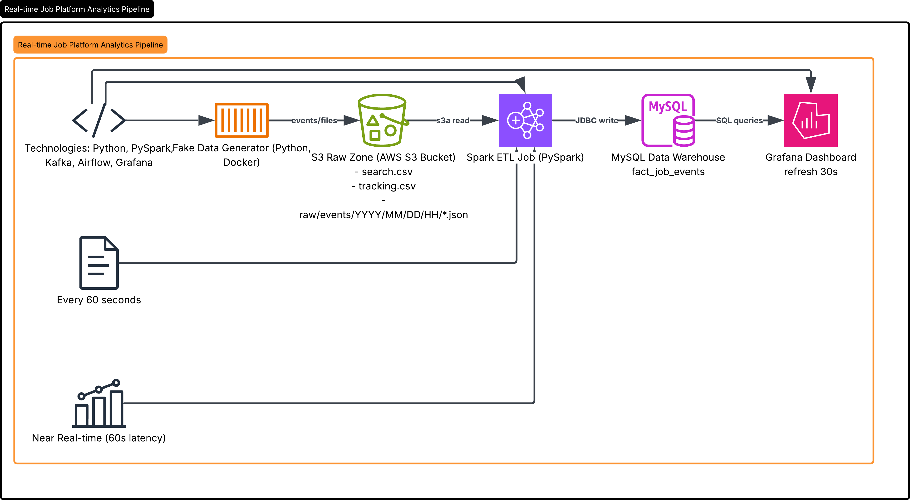
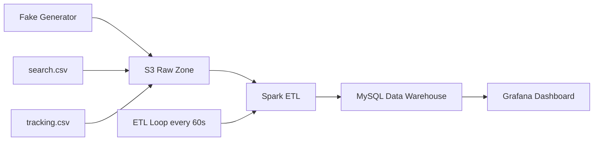

# Real-time Job Platform Analytics Pipeline

**Near Real-time Data Engineering Project** — Xây dựng pipeline xử lý dữ liệu tuyển dụng với kiến trúc Lakehouse hiện đại.


> *Near-realtime pipeline xử lý dữ liệu tuyển dụng với Spark + S3 + Grafana*
##  Giới thiệu

Dự án mô phỏng **toàn bộ quy trình Data Engineering** từ ingestion → processing → visualization cho một nền tảng tuyển dụng việc làm.

- **Generator** sinh dữ liệu giả realtime (6-8 events/giây)
- **Spark ETL** xử lý batch + near-realtime mỗi 60 giây
- **MySQL** làm Data Warehouse
- **Grafana** hiển thị dashboard cập nhật liên tục

**Mục tiêu**: Xây dựng pipeline near-realtime hoàn chỉnh

## 🛠 Tech Stack

| Layer              | Technology                          |
|--------------------|-------------------------------------|
| Cloud Storage      | AWS S3                              |
| Containerization   | Docker + Docker Compose             |
| Event Streaming    | Kafka (Confluent)                   |
| Processing         | PySpark 3.5                         |
| Data Lakehouse     | S3 + Iceberg (optional)             |
| Warehouse          | MySQL 8                             |
| Orchestration      | Airflow + Custom Loop               |
| Visualization      | Grafana                             |
| Language           | Python 3.11                         |

##  Kiến trúc Hệ thống



##  Features

- Sinh dữ liệu giả **realtime** dựa trên job_id thật từ `search.csv`
- ETL xử lý cả historical + realtime data
- Dashboard Grafana cập nhật tự động mỗi 30 giây
- Tự động refresh AWS credentials
- Clean architecture với Docker
- Chi tiết logging và monitoring

##  Project Structure

```
job-realtime-etl/
├── docker-compose.yml
├── docker/spark/Dockerfile
├── spark-apps/etl_job.py
├── simulate_realtime.py          # Fake data generator
├── etl_loop.sh                   # ETL scheduler
├── generator.log
├── etl_loop.log
├── search.csv
├── tracking.csv
└── dags/                         # Airflow DAGs
```

##  Cách Chạy Project

### Prerequisites
- AWS Account với IAM Role `S3FullAccess` attach vào EC2
- EC2 `t3.xlarge` (Ubuntu 22.04)

### 1. Clone & Start Stack

```bash
git clone <your-repo>
cd job-realtime-etl
docker compose up -d
```

### 2. Khởi động Generator

```bash
nohup python3 simulate_realtime.py > generator.log 2>&1 &
tail -f generator.log
```

### 3. Chạy ETL Loop

```bash
chmod +x etl_loop.sh
nohup ./etl_loop.sh > etl_loop.log 2>&1 &
```

### 4. Truy cập Dashboard

- **Grafana**: `http://<EC2-IP>:3000` (admin/admin)
- **Spark UI**: `http://<EC2-IP>:8080`
- **Airflow**: `http://<EC2-IP>:8081`

##  Dashboard Highlights

- Total Events & Events per Minute
- Top Jobs by Views
- Conversion Rate
- Event Type Distribution
- Average Salary by Category
- Live Events Trend
